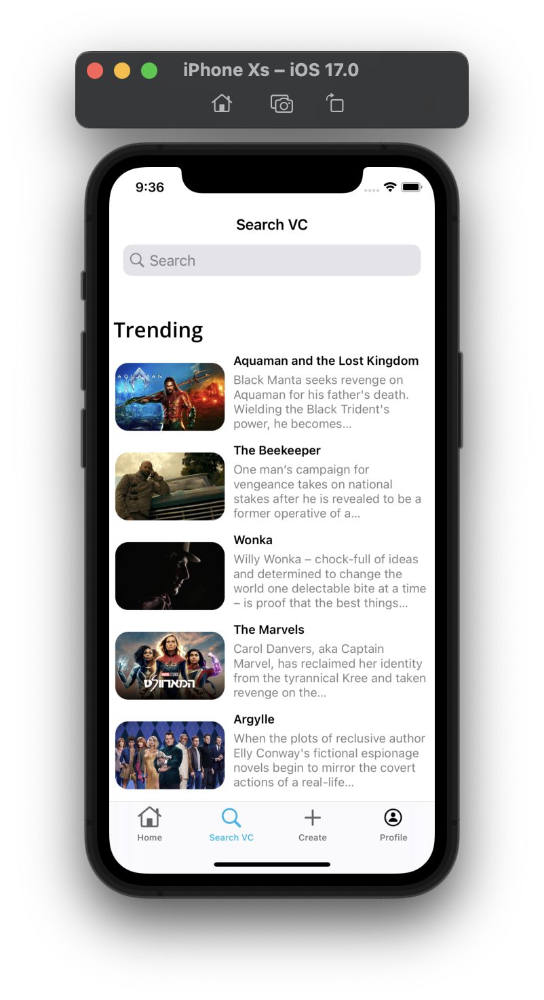
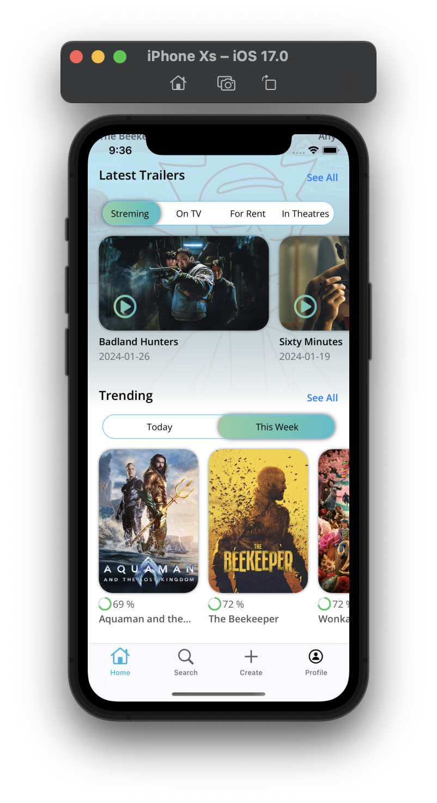

# Movies Info
A program designed to display movies and facts about the film and the actors who starred in the film. There are also recommendations and films in which this or that actor starred. 
Also, as an addition, a firebase has been introduced with the ability to initialize the user.

## Content
- [Technologies](#technologies)
- [Additionally](#additionally)
- [Screenshots](#screenshots)
- [Contributing](#contributing)

## Technologies
- Swift
- UIKit
- Code-only layout
- Auto Layout
- MVVM
- Coordinator
- Texture (AsyncDisplayKit)
- Without storyboard
- JSON 
- CollectionViews
- Combine
- Unit Tests (Quick/Nimble)
- UI Tests
- Firebase
- FireStore
- FireAuth

## Additionally
Added the option to send an error to the Firebase cloud. Login to the application using face ID or fingerprint has also been introduced, and user data such as the password is stored in the Keychain. It is also possible to delete the user and all data associated with him.

 

## Screenshots:
___

  

## Contributing
If you find a bug or remark in the code or when the program is running, please let me know for my email:
<a href="mailto:yura.sabadin@icloud.com">yura.sabadin@icloud.com</a>

### Why did I write this project?
___
In order to show your capabilities as a portfolio, and to acquire new and improve old skills and technologies.
I really enjoy writing code. Create applications from simple to complex multi-level ones. This really fascinates me...

